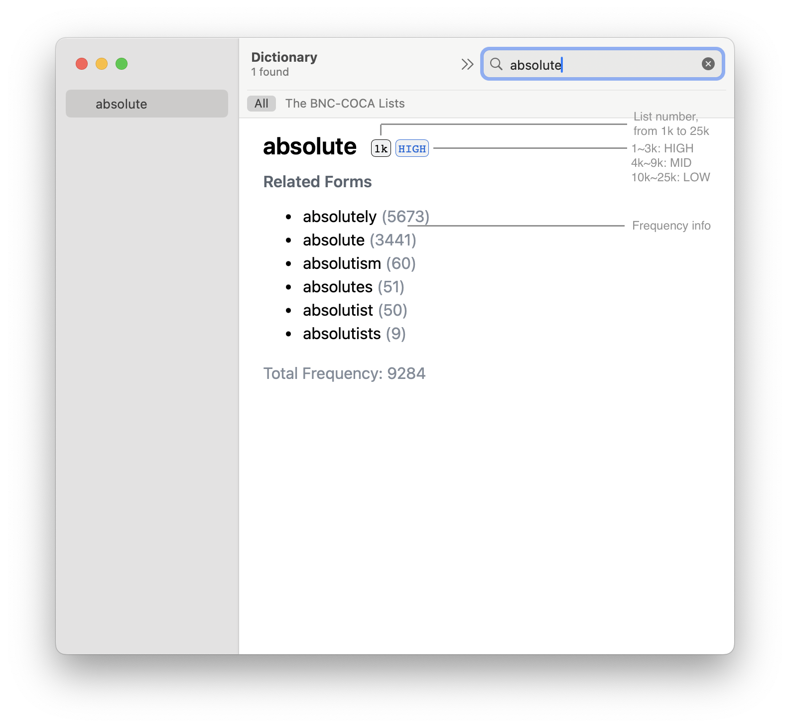

## The BNC-COCA Lists Dictionary

The BNC/COCA word family lists[^1], created by Paul Nation, are frequency-based lists designed primarily for learners of English as a foreign language. These lists group words into families based on their frequency of use, spanning 1,000-word bands from the most common 1,000 words to the 25,000 most frequent words in English. Their primary purpose is to aid vocabulary acquisition for graded readers, course books, and other study materials—particularly for contexts like foreign travel or selecting vocabulary for study.

This repository contains the code to create a dictionary of these lists, enabling users to quickly identify the 1,000-word level of the BNC/COCA word family lists in which a particular word appears. The dictionary is available in two formats:

- `.mdx` for [MDict](https://www.mdict.cn/wp/?lang=en)
- `.dictionary` for the built-in [Dictionary.app](https://support.apple.com/guide/dictionary/welcome/mac) in macOS

They can be downloaded from the [Releases page](https://github.com/wen-zhi/the-bnc-coca-lists/releases).

<p align="center">
  
</p>

## Build From Source

### Building `.mdx`

**Step 1:** Clone this repository and run the following command in the terminal to generate the source file for MDXBuilder. The script works with Python 3.10+ and does not require any additional third-party packages:

```bash
python3 -m bnc_coca_list.mdx_generator -i "data/basewords_130" -o "the-bnc-coca-lists.src.txt"
```

> The input data `basewords_130` can be downloaded from [WordFamilyFinder](https://laurenceanthony.net/software/wordfamilyfinder).

**Step 2:** Download MDXBuilder (a small Windows application) from [here](http://static.frdic.com/MdxBuilder3.zip). Open `MdxBuilder.exe` and follow these steps:

1. Select the file generated in Step 1 as the **Source**.
2. Set the **Target** (the output path for the `.mdx` file).
3. Fill in basic information about the dictionary, such as **Title** and **Description**, in the **Options** section.
4. Press **Start**, and the `.mdx` file will be generated in under one minute.

### Building `.dictionary`

Follow the [AppleDict instructions](https://github.com/ilius/pyglossary/blob/master/doc/apple.md) provided by [pyglossary](https://github.com/ilius/pyglossary) to convert the `.mdx` file into `.dictionary` format for the built-in Dictionary app on macOS.


[^1]: A detailed description of the BNC/COCA lists is available on Paul Nation's website: [Vocabulary Lists](https://www.wgtn.ac.nz/lals/resources/paul-nations-resources/vocabulary-lists).
